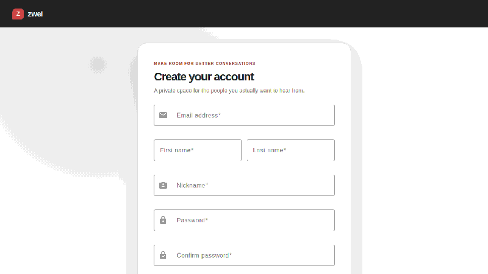

# Zwei

<p align="center">
  
</p>

<h2 align="center">Private conversations, deliberately simple.</h2>

<p align="center">
  Zwei gives people a calm, focused place to talk one-to-one—without turning messaging into a
  noisy social feed. Find someone, open a conversation, and stay present in the exchange.
</p>

<p align="center">
  <a href="docs/assets/zwei-demo.webm"></a>
</p>

<p align="center"><a href="docs/assets/zwei-demo.webm">Watch the full E2E demo video</a></p>

## What Zwei is about

- **Conversations that feel personal** — one-to-one chats keep attention on the person, not the feed.
- **A live sense of connection** — messages, presence, typing, delivery recovery, and read state work together naturally.
- **Privacy with accurate language** — Zwei protects application data and browser sessions without pretending that server-mediated encryption is end-to-end encryption.
- **A considerate interface** — dark and light themes, responsive layouts, keyboard-visible focus, reduced motion, and clear empty/loading/error states.

The demo follows the real user journey: registration, account activation, sign-in, and opening a conversation in Home.

## Tech stack

- Angular 22 and TypeScript for the browser client
- Go services for authentication, chat, and real-time messaging
- PostgreSQL for durable application data
- Redis for shared realtime coordination and rate limiting
- Docker Compose for reproducible local development
- Playwright for browser-level verification

## Run locally

Requirements: Docker Desktop and `make`.

```sh
make build
make migrate
make trust-local-ca   # macOS, once
```

Open `https://chat.localhost` after trusting the generated local certificate. Run the browser suite with:

```sh
make e2e
```

The E2E environment is isolated from the normal development database. Mailpit is available locally when inspecting test activation messages.

## Recreate the README demo

The README journey is a real Playwright flow, not a mock recording. Rebuild the images and run the focused recording flow with:

```sh
make build
make demo
```

Playwright writes the full WebM recording and checkpoint screenshots under `e2e/test-results/`. The committed GIF is the lightweight README preview derived from those checkpoints.

## Contributing

Contributions are welcome. A simple workflow:

1. Fork the repository and create a focused branch.
2. Make the smallest coherent change that preserves existing behavior.
3. Add focused tests for new domain, service, adapter, frontend, or browser behavior.
4. Run the checks relevant to your change before opening a pull request:

   ```sh
   go test ./services/...
   go test -race ./services/...
   go vet ./services/...
   npm --prefix frontend-app test -- --watch=false --browsers=ChromeHeadless
   npm --prefix frontend-app run build
   make e2e
   ```

5. Review the diff for accidental files, leaked credentials, misleading product claims, and accessibility regressions.

Please keep secrets, local environment files, generated test artifacts, and private configuration out of commits. For larger product or compatibility decisions, open an issue first so the behavior and protocol boundaries can be discussed before implementation.
